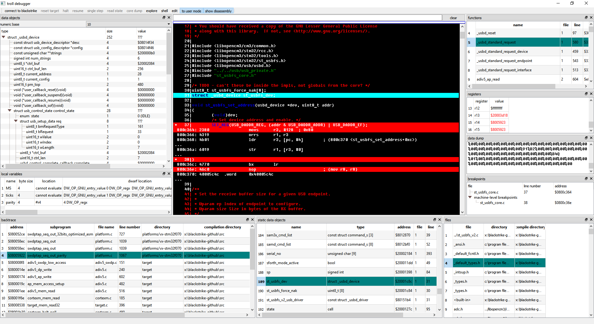
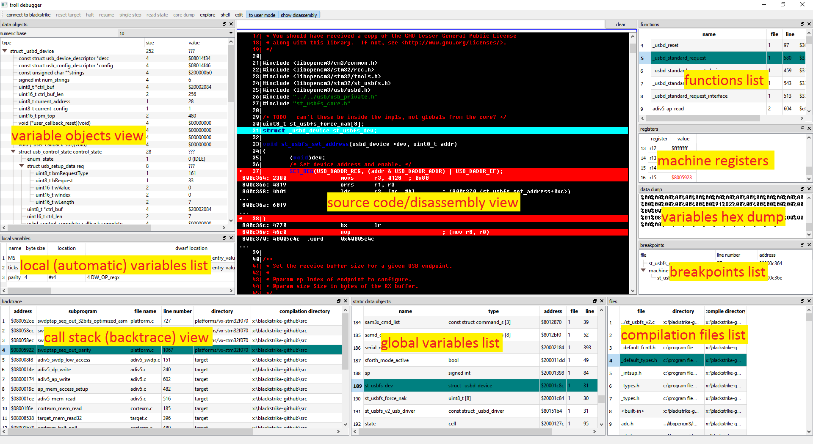
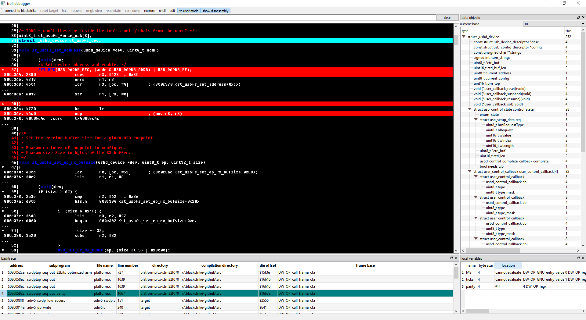

# Troll

The *troll* is a C-language source-level debugger for *ARM Cortex-M* systems,
accessed with the excellent *blackmagic* hardware debug probe, and a customized
variant of the *blackmagic* - the *vx/blackstrike* (or *blackstrike* for short).
The *troll* only supports source-level debugging of source code programs
written in the *C* programming language, compiled to executable files in the
*ELF* format, containig *DWARF* debug information.

Note that this is a very special case of a debugger:
- it only targets *ARM* Cortex-M based systems
- only the C language is supported for source-level debugging
- only the *blackmagic* and *blackstrike* hardware debug probes are supported
- tre *troll* itself is written in *C++*
- the *troll* itself heavily relies on the Qt framework

Here is a screenshot of the *troll*'s graphical user interface, as of 28022017:



This is an annotated version of the screenshot above, showing the various display
views of the *troll*:



Here is a simplified, more realistic in everyday usage, view, as of 28022017::




### Testing the *troll*

It is simple and easy to give the *troll* a try!
For debugging and evaluation purposes, the *troll* supports operation
in a so-called *static test-drive* mode.
In this mode, no connection to a live target system is established, and
instead the *troll* reads the contents of target memory and registers
from files. In this mode, the *troll* does not invoke any external
tools it otherwise relies upon, and all necessary data for the *troll*'s
operation is being fetched from files with hard-coded names.
This *static test-drive mode of operation* is intended for *troll*
rapid prototyping and debugging, and demonstration of the capabilities
of the *troll*.

To give the *troll* a try, first clone it from github, and initialize
and update submodules:
```sh
git clone https://github.com/stoyan-shopov/troll.git
cd troll
git submodule init
git submodule update
```
Next, build the troll. The *troll* makes use of the *Qt* framework.
I prefer building the *troll* from within the *Qt Creator* IDE, but
you may also build it by using the *qmake* and *make* utilities,
directly from the command line.

Finally, do obtain a *static test-drive* set of test files from here:

https://github.com/stoyan-shopov/troll-test-drive-snapshots

Extract the `troll-test-drive-files` directory in the *troll*'s working directory.


Now you are all set up, and ready to go - just run the *troll*.


### Troll internals

As of time of writing this (01042017), the *troll* has been in
intermittent development for roughly six months. This project is
still **very experimental and immature**, but I (Shopov) believe
it does look promising. The code is currently horrible,
undocumented, and looks evil. Yet, it does have one virtue -
the code is *small*. The essential *troll* code is in just
two source code files - these are `troll.cxx` and `libtroll.hxx`.
The code in file `troll.cxx` is the debugger 'front-end' -
it drives the graphical user interface and communicates with
the target device that is being debugged - this file is currenly
roughly **1500** lines of code. The code in file `libtroll.hxx`
decodes the *DWARF* debug information and supplies the front-end
with easy-to-use information such as how to unwind the target
call stack, what the data type of a data object is, where
data objects reside in the target, what
address, or addresses, of generated machine code correspond to
a line in the source code - that is useful for operating on breakpoints,
what the local variables in a subprogram are - and much, much more.
This file is currently roughly **2400** lines of code.
Together, the code of the *troll* debugger front-end (in file `troll.cxx`),
and the debug information processing engine (in file `libtroll.hxx`) - in all,
are roughly ***4000*** lines of code.


Even though in many respects broken and incompletely supported, these ***4000***
lines of code currently do provide these debugging capabilities:
- target call stack unwinding (including stack unwinding from within interrupt service routines)
- structured data displaying - array displaying, hierarchical displaying
of data structures, support for bitfields and decoding of *C* language enumerator
values to symbolic names
- displaying of the current source code location in the program being debugged,
with optional disassembling of the source code
- providing a list of subprograms (*C* functions), global and local (to subprograms) data objects
in the source code program, and navigation in the source code to the place
of definition of the subprograms and data objects
- target execution control - setting/clearing of breakpoints, instruction-level
stepping, resuming, halting and restarting target execution
- target flash memory programming and verification

The code of the *troll* needs to grow in order to completely and
gracefully support all of the features described above, but how
is it possible to support all of the features described in a meager
***4000*** lines of code?

The observations described below have been taken in account in order
to keep the code of the *troll* small and simple:
1. the *troll* does not attempt to support any target architecture
other than the *ARM Cortex-M*, and any target source code language,
other than the *C* language; besides, the *troll* is written in *C++*,
and makes heavy use of the *Qt* framework, and of the facilities that
the *Qt* framework provides
2. normally, a debugger utilizes some library that provides
structured access to the compiler-generated executable file
(e.g., in the *ELF* file format), in order to access sections
of debugging information and generated machine code that
resides in the target. Such a library, for example, is the
`libbfd` library - the *Binary File Descriptor* library, or the `libelf` library.
The *troll* does not use such a library. In order to locate
the *DWARF* debug information sections in the compiler-generated
executable file in the *ELF* file format, the *troll* simply
executes the `objdump` utility in order to display the
locations of the debug information sections, then parses
the output of the `objdump` utiility, and finally uses the
information provided by the `objdump` utility to simply
read the debug information sections - with simple file
access operations. This is a couple of lines of *C++* code,
instead of incorporating and utilizing a library, such as
the `libbfd/libelf` library. Also, in order to extract the
machine code that resides in the target - the *troll*
executes the `objcopy` utility in order to generate an
*s-record* file (often used in production for programming
target chips) - out of the *ELF* executable file. Parsing
an *s-record* file is trivial, and just a couple of lines
of *C++* code, and no library, such as `libbfd/libelf`, is needed in
order to achieve this
3. likewise, the *troll* does not use a disassembler library
(such as, for example, the `libopcodes` library) - instead,
the *troll* runs the `objdump` utility in order to generate
a disassembly listing of the target executable *ELF* file,
and then parses the disassembly output, builds an index for
this output, and uses the index for providing disassembly
text for target addresses. Such an approach is very simple,
and achieves good results with only a few lines of source
code, and avoids the need for an external library for
performing the disassembly
4. there exist excellent general-purpose libraries for
accessing *DWARF* debug information - such is the
`libdwarf` library. A key decision in the *troll* is
***TO NOT*** use such a library, and the `libdwarf`
library in particular. The *troll* is not my first
attempt to write a debugger, it is the third one,
and from my previous, already abandoned, attempts,
I learned, that - when your goal is to create a
***very limited, special purpose*** debugger
such as the *troll* - it is ***much easier, simpler,
and more efficient*** to just decode and process the *DWARF*
debug information yourself. A graphical debugger front-end
really needs simple answers to questions such as:
	- Where in the program I am now, and how did I get here, so
that I can display a call-stack backtrace?
	- Where are local and global variables located, so that I
can display their values?
	- What is the data type of a variable, so that I
can nicely display it?
	- What target machine address(es)
correspond(s) to a line in the source-code, so that I can
set a breakpoint there?
	- What target machine addresses correspond to
a source-code file, so that I can display a disassembly
of the source code, if requested?

General-purpose libraries, such as `libdwarf`, do not readily
provide answers to such simple questions, because, well, they
are *general-purpose libraries* - they provide you with relatively
low-level access to the *DWARF* debug information.
Engineering sane answers to the simple questions from above can
be very involved, technically.
If you need to answer these questions by using such a library,
you need to build an additional layer over such a library, which
will provide the answers. In my experience, this may be not
too pretty and pleasant. Decoding *DWARF* debug information
is surprisingly easy (if you are familiar with *DWARF*).
Deciding ***NOT*** to use a library, such as `libdwarf`,
for accessing *DWARF* debug information, eliminates the
need of building a layer around such a library, avoids
the burden of dependencies of such a library, and - avoids
the need of debugging such a library (yes, I had to debug
the `libdwarf` library on some occasions in the past).

In summary, deciding ***NOT*** to use a general-purpose
library for accessing the *DWARF* debug information by the
*troll*, makes the *troll* code simpler, smaller, more
straightforward, more efficient, and, I hope, easier to
maintain, understand and modify.

5. FORTH. This fifth point is quite technical. Technically,
describing the locations of variables in the machine-code
program generated by a compiler, and how to unwind
the target call stack, can be complicated. Therefore,
a form of powerful, yet compact, easy to produce, easy to consume, and
easy to debug, encoding of such information is essential.
In *DWARF*, this has been addressed by defining a 
*virtual, stack-oriented machine*, and a set of
*instructions* defined for this *virtual machine*.
This, in essence, is FORTH. The computation of data
object locations, and call-stack unwinding, in the *troll*,
is written in *FORTH*, it seemed most natural to do so,
but will probably turn down anyone that wishes to study
and modify the code of the *troll*. Most probably, this
part of the *troll* will be rewritten in some popular
programming language in the future.
